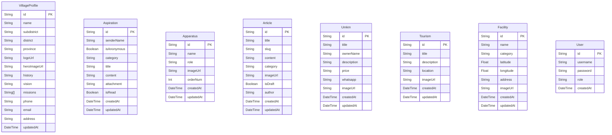

# Database — Website Profil Desa Sukabanjar

## Teknologi Database

| Komponen | Teknologi |
|---|---|
| Database Engine | PostgreSQL (Supabase Free Tier — 500MB) |
| ORM | Prisma ORM |
| Media Storage | Supabase Storage / Cloudinary Free |

---

## ERD (Entity Relationship Diagram)



> **Catatan:** Seluruh model bersifat independen (tidak ada relasi foreign key antar tabel) sesuai desain PRD. Setiap model merepresentasikan entitas data desa yang terpisah.

---

## Daftar Tabel

| No | Tabel | Deskripsi | Jumlah Field |
|---|---|---|---|
| 1 | `VillageProfile` | Data identitas desa, visi, misi, kontak | 14 |
| 2 | `Aspiration` | Pesan aspirasi/pengaduan warga (model pesan langsung) | 10 |
| 3 | `Apparatus` | Data perangkat desa (struktur organisasi) | 6 |
| 4 | `Article` | Artikel berita & pengumuman desa | 9 |
| 5 | `Umkm` | Data UMKM & produk lokal desa | 8 |
| 6 | `Tourism` | Data destinasi wisata & pemandangan alam | 6 |
| 7 | `Facility` | Titik lokasi bangunan/fasilitas penting di peta | 8 |
| 8 | `User` | Akun admin desa (autentikasi CMS) | 5 |

---

## Detail Tabel & Constraint

### 1. VillageProfile

| Field | Type | Constraint | Deskripsi |
|---|---|---|---|
| id | String | PK, UUID auto-generate | Primary key |
| name | String | Default: "Sukabanjar" | Nama desa |
| subdistrict | String | Default: "Sidomulyo" | Kecamatan |
| district | String | Default: "Lampung Selatan" | Kabupaten |
| province | String | Default: "Lampung" | Provinsi |
| logoUrl | String? | Nullable | URL logo desa |
| heroImageUrl | String? | Nullable | URL hero image |
| history | String | Text type | Sejarah desa (Rich Text) |
| vision | String | Text type | Teks visi desa |
| missions | String[] | Array | Poin-poin misi desa |
| phone | String? | Nullable | Nomor telepon desa |
| email | String? | Nullable | Email desa |
| address | String? | Nullable | Alamat kantor desa |
| updatedAt | DateTime | Auto-update | Timestamp terakhir diperbarui |

### 2. Aspiration

| Field | Type | Constraint | Deskripsi |
|---|---|---|---|
| id | String | PK, UUID auto-generate | Primary key |
| senderName | String | Required | Nama pengirim (atau "Anonim") |
| isAnonymous | Boolean | Default: false | Penanda mode anonim |
| category | String | Required | Kategori: Fasilitas Publik, Kebersihan/Lingkungan, Keamanan, Saran/Masukan, Lainnya |
| title | String | Required | Judul pesan aspirasi |
| content | String | Text type | Isi pesan aspirasi/pengaduan |
| attachment | String? | Nullable | URL foto bukti (opsional) |
| isRead | Boolean | Default: false | Penanda sudah dibaca Admin |
| createdAt | DateTime | Auto-generate | Timestamp dibuat |
| updatedAt | DateTime | Auto-update | Timestamp terakhir diperbarui |

### 3. Apparatus

| Field | Type | Constraint | Deskripsi |
|---|---|---|---|
| id | String | PK, UUID auto-generate | Primary key |
| name | String | Required | Nama perangkat desa |
| role | String | Required | Jabatan |
| imageUrl | String? | Nullable | URL foto |
| orderNum | Int | Default: 0 | Urutan tampilan hirarki |
| createdAt | DateTime | Auto-generate | Timestamp dibuat |
| updatedAt | DateTime | Auto-update | Timestamp diperbarui |

### 4. Article

| Field | Type | Constraint | Deskripsi |
|---|---|---|---|
| id | String | PK, UUID auto-generate | Primary key |
| title | String | Required | Judul artikel |
| slug | String | Unique | URL slug artikel |
| content | String | Text type | Isi konten artikel (WYSIWYG) |
| category | String | Required | Kategori: Pengumuman, Kegiatan, KKN, Pembangunan |
| imageUrl | String? | Nullable | URL foto cover |
| isDraft | Boolean | Default: false | Status publikasi |
| author | String | Default: "Admin Desa" | Nama penulis |
| createdAt | DateTime | Auto-generate | Timestamp dibuat |
| updatedAt | DateTime | Auto-update | Timestamp diperbarui |

### 5. Umkm

| Field | Type | Constraint | Deskripsi |
|---|---|---|---|
| id | String | PK, UUID auto-generate | Primary key |
| title | String | Required | Nama usaha / produk |
| ownerName | String | Required | Nama pemilik UMKM |
| description | String | Text type | Deskripsi produk |
| price | String | Required | Harga produk |
| whatsapp | String | Required | Nomor WhatsApp penjual |
| imageUrl | String? | Nullable | URL foto produk |
| createdAt | DateTime | Auto-generate | Timestamp dibuat |
| updatedAt | DateTime | Auto-update | Timestamp diperbarui |

### 6. Tourism

| Field | Type | Constraint | Deskripsi |
|---|---|---|---|
| id | String | PK, UUID auto-generate | Primary key |
| title | String | Required | Nama tempat wisata |
| description | String | Text type | Deskripsi wisata |
| location | String | Required | Informasi lokasi/rute |
| imageUrl | String? | Nullable | URL foto wisata |
| createdAt | DateTime | Auto-generate | Timestamp dibuat |
| updatedAt | DateTime | Auto-update | Timestamp diperbarui |

### 7. Facility

| Field | Type | Constraint | Deskripsi |
|---|---|---|---|
| id | String | PK, UUID auto-generate | Primary key |
| name | String | Required | Nama bangunan/fasilitas |
| category | String | Required | Kategori: Pemerintahan, Pendidikan, Kesehatan, Ibadah, Ekonomi |
| latitude | Float | Required | Koordinat lintang |
| longitude | Float | Required | Koordinat bujur |
| address | String? | Nullable | Alamat fasilitas |
| imageUrl | String? | Nullable | URL foto bangunan |
| createdAt | DateTime | Auto-generate | Timestamp dibuat |
| updatedAt | DateTime | Auto-update | Timestamp diperbarui |

### 8. User

| Field | Type | Constraint | Deskripsi |
|---|---|---|---|
| id | String | PK, UUID auto-generate | Primary key |
| username | String | Unique | Username admin |
| password | String | Required | Password ter-hash |
| role | String | Default: "ADMIN" | Role pengguna |
| createdAt | DateTime | Auto-generate | Timestamp dibuat |

---

## Prisma Schema (Lengkap)

```prisma
// prisma/schema.prisma

datasource db {
  provider = "postgresql"
  url      = env("DATABASE_URL")
}

generator client {
  provider = "prisma-client-js"
}

// 1. Data Identitas Desa & Visi Misi
model VillageProfile {
  id           String   @id @default(uuid())
  name         String   @default("Sukabanjar")
  subdistrict  String   @default("Sidomulyo")
  district     String   @default("Lampung Selatan")
  province     String   @default("Lampung")
  logoUrl      String?
  heroImageUrl String?
  history      String   @db.Text
  vision       String   @db.Text
  missions     String[] // Array String untuk poin-poin misi
  phone        String?
  email        String?
  address      String?
  updatedAt    DateTime @updatedAt
}

// 2. Modul E-Aspirasi & Pengaduan Warga (Simple Text Message Model)
model Aspiration {
  id          String   @id @default(uuid())
  senderName  String   // Nama pengirim (atau "Anonim" jika isAnonymous = true)
  isAnonymous Boolean  @default(false)
  category    String   // "Fasilitas Publik", "Kebersihan/Lingkungan", "Keamanan", "Saran/Masukan", "Lainnya"
  title       String
  content     String   @db.Text // Isi pesan teks aspirasi/pengaduan (seperti email)
  attachment  String?  // URL Foto Bukti Laporan (Opsional)
  isRead      Boolean  @default(false) // Penanda status dibaca di Inbox Admin Desa
  createdAt   DateTime @default(now())
  updatedAt   DateTime @updatedAt
}

// 3. Data Perangkat Desa (Struktur Organisasi)
model Apparatus {
  id        String   @id @default(uuid())
  name      String
  role      String
  imageUrl  String?
  orderNum  Int      @default(0) // Untuk urutan tampilan hirarki
  createdAt DateTime @default(now())
  updatedAt DateTime @updatedAt
}

// 4. Modul Berita & Artikel
model Article {
  id        String   @id @default(uuid())
  title     String
  slug      String   @unique
  content   String   @db.Text
  category  String   // "Pengumuman", "Kegiatan", "KKN", "Pembangunan"
  imageUrl  String?
  isDraft   Boolean  @default(false)
  author    String   @default("Admin Desa")
  createdAt DateTime @default(now())
  updatedAt DateTime @updatedAt
}

// 5. Modul UMKM Desa
model Umkm {
  id          String   @id @default(uuid())
  title       String
  ownerName   String
  description String   @db.Text
  price       String
  whatsapp    String
  imageUrl    String?
  createdAt   DateTime @default(now())
  updatedAt   DateTime @updatedAt
}

// 6. Modul Wisata & Pemandangan
model Tourism {
  id          String   @id @default(uuid())
  title       String
  description String   @db.Text
  location    String
  imageUrl    String?
  createdAt   DateTime @default(now())
  updatedAt   DateTime @updatedAt
}

// 7. Modul Peta Bangunan & Fasilitas Penting
model Facility {
  id        String   @id @default(uuid())
  name      String
  category  String   // "Pemerintahan", "Pendidikan", "Kesehatan", "Ibadah", "Ekonomi"
  latitude  Float
  longitude Float
  address   String?
  imageUrl  String?
  createdAt DateTime @default(now())
  updatedAt DateTime @updatedAt
}

// 8. User Admin
model User {
  id        String   @id @default(uuid())
  username  String   @unique
  password  String   // Hashed password
  role      String   @default("ADMIN")
  createdAt DateTime @default(now())
}
```
